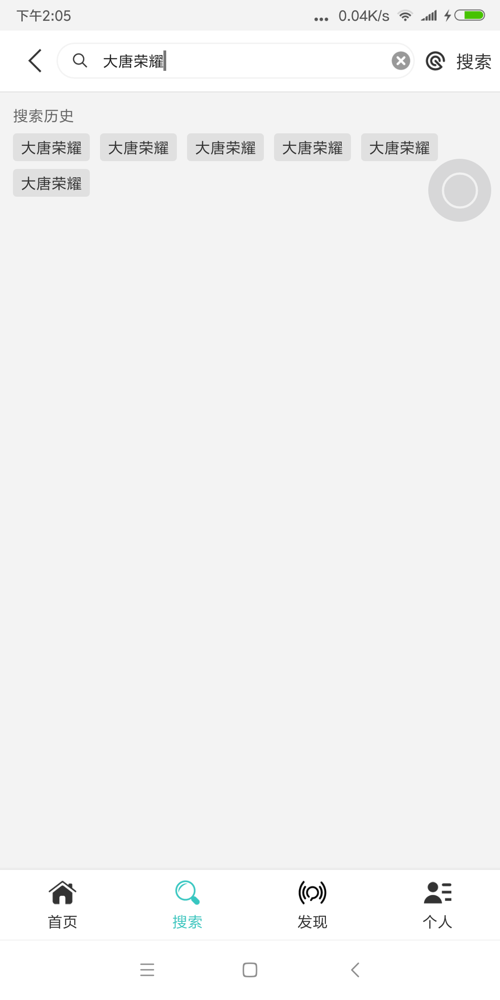
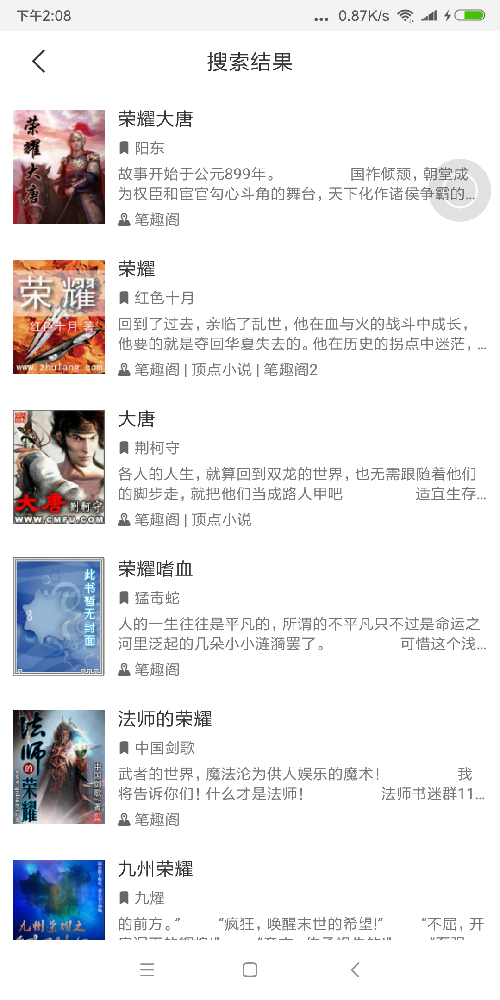
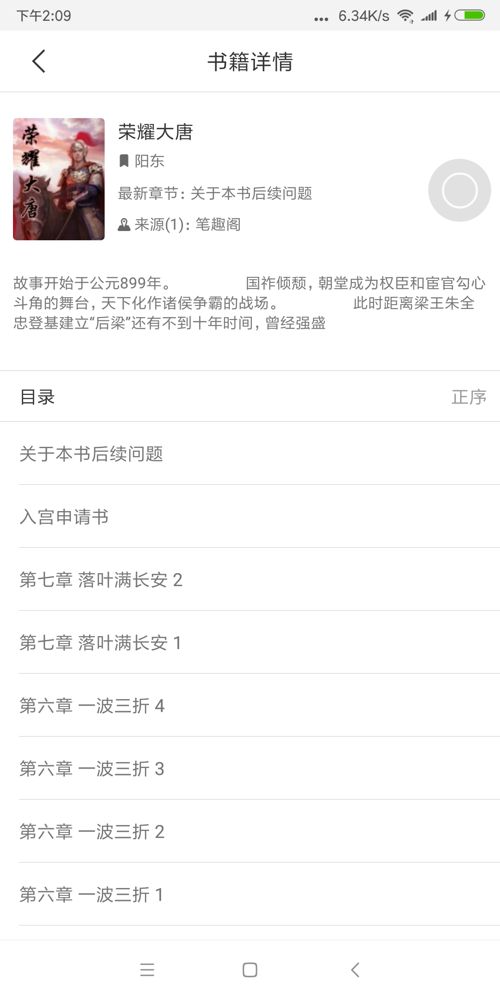
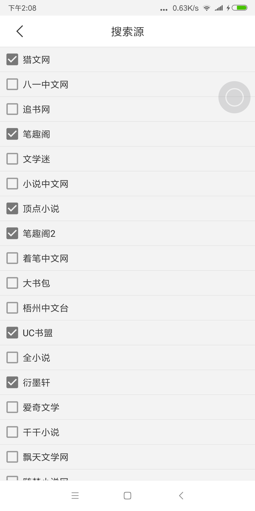

# CrawlerForReader

BookReader is being sponsored by the following tool; please help to support us by taking a look and signing up to a free trial

<a href="https://tracking.gitads.io/?repo=BookReader"> </a>

Android 本地网络小说爬虫，基于 jsoup 与 xpath，通过模版解析网页。

阅读器实现：[https://github.com/smuyyh/BookReader](https://github.com/smuyyh/BookReader)

- [支持书源](#支持书源)
- [模版示例](#模版示例)
- [调用方式](#调用方式)
- [ScreenShot](#screenshot)

## 支持书源

```java
/**
 * 所有书源
 */
public static final SparseArray<Source> SOURCES = new SparseArray<Source>() {
    {
        put(SourceID.LIEWEN, new Source(SourceID.LIEWEN, "猎文网", "https://www.liewen.cc/search.php?keyword=%s"));
        put(SourceID.CHINESE81, new Source(SourceID.CHINESE81, "八一中文网", "https://www.zwdu.com/search.php?keyword=%s"));
        put(SourceID.ZHUISHU, new Source(SourceID.ZHUISHU, "追书网", "https://www.zhuishu.tw/search.aspx?keyword=%s"));
        put(SourceID.BIQUG, new Source(SourceID.BIQUG, "笔趣阁", "http://zhannei.baidu.com/cse/search?s=1393206249994657467&q=%s"));
        put(SourceID.WENXUEMI, new Source(SourceID.WENXUEMI, "文学迷", "http://www.wenxuemi.com/search.php?keyword=%s"));
        put(SourceID.CHINESEXIAOSHUO, new Source(SourceID.CHINESEXIAOSHUO, "小说中文网", "http://www.xszww.com/s.php?ie=gbk&s=10385337132858012269&q=%s"));
        put(SourceID.DINGDIAN, new Source(SourceID.DINGDIAN, "顶点小说", "http://zhannei.baidu.com/cse/search?s=1682272515249779940&q=%s"));
        put(SourceID.BIQUGER, new Source(SourceID.BIQUGER, "笔趣阁2", "http://zhannei.baidu.com/cse/search?s=7928441616248544648&ie=utf-8&q=%s"));
        put(SourceID.CHINESEZHUOBI, new Source(SourceID.CHINESEZHUOBI, "着笔中文网", "http://www.zbzw.com/s.php?ie=utf-8&s=4619765769851182557&q=%s"));
        put(SourceID.DASHUBAO, new Source(SourceID.DASHUBAO, "大书包", "http://zn.dashubao.net/cse/search?s=9410583021346449776&entry=1&ie=utf-8&q=%s"));
        put(SourceID.CHINESEWUZHOU, new Source(SourceID.CHINESEWUZHOU, "梧州中文台", "http://www.gxwztv.com/search.htm?keyword=%s"));
        put(SourceID.UCSHUMENG, new Source(SourceID.UCSHUMENG, "UC书盟", "http://www.uctxt.com/modules/article/search.php?searchkey=%s", 4));
        put(SourceID.QUANXIAOSHUO, new Source(SourceID.QUANXIAOSHUO, "全小说", "http://qxs.la/s_%s"));
        put(SourceID.YANMOXUAN, new Source(SourceID.YANMOXUAN, "衍墨轩", "http://www.ymoxuan.com/search.htm?keyword=%s"));
        put(SourceID.AIQIWENXUE, new Source(SourceID.AIQIWENXUE, "爱奇文学", "http://m.i7wx.com/?m=book/search&keyword=%s"));
        put(SourceID.QIANQIANXIAOSHUO, new Source(SourceID.QIANQIANXIAOSHUO, "千千小说", "http://www.xqqxs.com/modules/article/search.php?searchkey=%s", 4));
        put(SourceID.PIAOTIANWENXUE, new Source(SourceID.PIAOTIANWENXUE, "飘天文学网", "http://www.piaotian.com/modules/article/search.php?searchtype=articlename&searchkey=%s"));
        put(SourceID.SUIMENGXIAOSHUO, new Source(SourceID.SUIMENGXIAOSHUO, "随梦小说网", "http://m.suimeng.la/modules/article/search.php?searchkey=%s", 4));
        put(SourceID.DAJIADUSHUYUAN, new Source(SourceID.DAJIADUSHUYUAN, "大家读书苑", "http://www.dajiadu.net/modules/article/searchab.php?searchkey=%s"));
        put(SourceID.SHUQIBA, new Source(SourceID.SHUQIBA, "书旗吧", "http://www.shuqiba.com/modules/article/search.php?searchkey=%s", 4));
        put(SourceID.XIAOSHUO52, new Source(SourceID.XIAOSHUO52, "小说52", "http://m.xs52.com/search.php?searchkey=%s"));
    }
};
```

## 模版示例

例如针对猎文网：

```json
{
    "id": 1, //对应书源id
    "search": { //搜索页解析规则
      "charset": "UTF-8",
      "xpath": "//div[@class='result-item result-game-item']",
      "coverXpath": "//div[@class='result-game-item-pic']//a//img/@src",
      "titleXpath": "//div[@class='result-game-item-detail']//h3//a/@title",
      "linkXpath": "//div[@class='result-game-item-detail']//h3//a/@href",
      "authorXpath": "//div[@class='result-game-item-detail']//div[@class='result-game-item-info']//p[1]/span[2]/text()",
      "descXpath": "//div[@class='result-game-item-detail']//p[@class='result-game-item-desc']/text()"
    },
    "catalog": { //目录列表解析规则
      "xpath": "//div[@id=list]//dl//dd",
      "titleXpath": "//a/text()",
      "linkXpath": "//a/@href"
    },
    "content": { //文章内容解析规则
      "xpath": "//div[@id='content']/text()"
    }
  }
```

## 调用方式

目前虽然请求结果是通过 Callback形式，因为搜多个源是分批返回结果。内部当仍是同步请求，没有做线程调度。

```java
Crawler.search("你好", new SearchCallback() {
    @Override
    public void onResponse(String keyword, List<SearchBook> appendList) {
    }

    @Override
    public void onFinish() {

    }

    @Override
    public void onError(String msg) {

    }
});
Crawler.catalog(new SearchBook.SL("https://www.liewen.cc/b/24/24934/", SourceManager.SOURCES.get(1)), new ChapterCallback() {
    @Override
    public void onResponse(List<Chapter> chapters) {

    }

    @Override
    public void onError(String msg) {

    }
});

Crawler.content(new SearchBook.SL("https://www.liewen.cc/b/24/24934/", SourceManager.SOURCES.get(1)), "/b/24/24934/12212511.html", new ContentCallback() {
    @Override
    public void onResponse(String content) {

    }

    @Override
    public void onError(String msg) {

    }
});
```

## ScreenShot

### Search



### SearchResult



### BookDetail



### ChangeSource



## License
```
   Copyright 2016 smuyyh, All right reserved.

   Licensed under the Apache License, Version 2.0 (the "License");
   you may not use this file except in compliance with the License.
   You may obtain a copy of the License at

       http://www.apache.org/licenses/LICENSE-2.0

   Unless required by applicable law or agreed to in writing, software
   distributed under the License is distributed on an "AS IS" BASIS,
   WITHOUT WARRANTIES OR CONDITIONS OF ANY KIND, either express or implied.
   See the License for the specific language governing permissions and
   limitations under the License.
```
